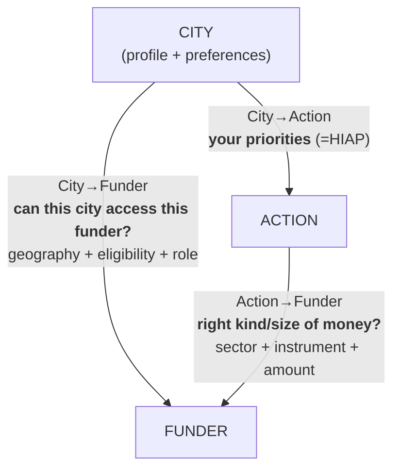

# City ↔ Funder Matching Engine

*Unlock the Money — Idea #3. Cities have needs, funders have instruments, and the matching is manual today. This is a recommendation engine that matches a city's climate actions to the funding instruments it can realistically pursue — and where one city is too small, pools its neighbours into financeable packages. Two surfaces on one engine: a premium CityCatalyst feature for **cities** ("fund my plan") and a deal pipeline for **regions and development banks** ("your pooled, de-risked packages").*

**Scope:** Chile · **Hero city:** Valdivia (Los Ríos)

Built on OEF's Chile climate-finance inventory (78 funds, 102 actions) plus municipal capacity and coordination work developed during the hackday.

## Team

- Amanda
- Ayinawu
- Brian
- Cephas

## The model — 3 entities, 3 alignments



A **match** is when all three align. But each edge is useful alone, and a *broken* edge names the gap. **We focus on the two funding edges** (City→Action is HIAP's job, already solved).

- **City→Funder** — action-agnostic, once per city. Geography (national / regional-GORE / enrolment) × city eligibility, with a **role**: *applicant / facilitator / referrer*. → "funders open to you."
- **Action→Funder** — city-agnostic, country-level, reusable across all cities. Sector fit × instrument fit (amount = adequacy, flagged). → "financing playbook" per action type.
- **Linchpin = actor eligibility.** The actor gap (a fund exists but the city can't apply) falls out naturally when the two edges *disagree*.

Full model: [`research/00-problem-and-model.md`](research/00-problem-and-model.md)

## What we built

### Two funding edges (Valdivia)

| Edge | Output | Headline result |
|------|--------|-----------------|
| **City→Funder** | [`data/derived/valdivia_funders_open.csv`](data/derived/valdivia_funders_open.csv) | 52 funds Valdivia can apply to directly · 1 facilitator (Casa Solar) · 25 referrer-only (FPA family + CORFO firm instruments) |
| **Action→Funder** | [`data/derived/valdivia_action_matches.csv`](data/derived/valdivia_action_matches.csv) | Energy/waste/AFOLU well-served by grants; **transport has no dedicated instrument** (best fit: generic SUBDERE PMR at 0.61); industry via firm-actor CORFO → "refer local firms" |

### Pooling & bundling (the differentiator)

When a single comuna can't clear a funder's threshold, pool neighbours that share both eligibility and a **coordinated action** (e-buses, LED streetlights, etc.) into one financeable package. This is the engine's **region-facing surface**: a GORE / FNDR / municipal association gets a ready pipeline of pooled deals, each with its lead (**anchor**) comuna identified and the anchor-less comunas flagged for TA.

| Layer | Output | What it does |
|-------|--------|--------------|
| Action coordination tiers | [`data/derived/action_coordination.csv`](data/derived/action_coordination.csv) | 🟢/🟡/🔴 per action — gates what can be pooled |
| City capacity | [`data/derived/comuna_capacity_scores.csv`](data/derived/comuna_capacity_scores.csv) | `anchor_score` + `cofinance_score` for 314 comunas |
| Coordination units | [`data/derived/coordination_units.csv`](data/derived/coordination_units.csv) | 77 contiguity-based units; Valdivia anchors **unit 11** (6 comunas) |
| National bundle candidates | [`data/derived/unit_bundle_candidates.csv`](data/derived/unit_bundle_candidates.csv) | 308 feasible municipal bundles across 62 multi-comuna units |

Theory and demo narrative: [`product-design.md`](product-design.md) · [`research/04-action-coordination.md`](research/04-action-coordination.md) · [`research/06-national-bundles.md`](research/06-national-bundles.md)

## Key findings

- **Funders are transparent — but per-call, PDF-bound, ephemeral.** Eligibility, amounts, scoring rubrics live in each call's *Bases* document. Fix: **live per-call enrichment**, not a static re-harvest.
- **Application windows are short** (~3–6 weeks; 31/78 funds annual, ~22 open at any moment) → cities must be *pre-staged*, not just well-matched.
- **City profiles give GPC-subsector emissions** but population was null until joined with census; rural comunas are often net carbon sinks → weight by *gross sectoral* emissions, not net.
- **Licensing:** surface *facts* (not verbatim PDFs), attribute + link, don't mirror. CORFO is CC BY-NC-ND; fondos.gob.cl is index-only.

More: [`research/02-findings.md`](research/02-findings.md)

## Repo layout

```
city–funder-matching/
├── README.md                 ← this file
├── product-design.md         ← demo brief (5-screen walkthrough, pooling payoff)
├── requirements.txt          ← notebook deps (geopandas, folium, …)
├── notebooks/
│   └── analyze.ipynb         ← summaries + interactive maps
├── research/                 ← problem framing, model, findings, coordination, bundling
└── data/
    ├── input/                ← canonical inputs (actions, funders, indicators, boundaries)
    │   └── README.md
    ├── raw/                  ← SINIM / FCM source snapshots (+ licence notes)
    └── derived/              ← engine outputs (scores, matches, units, bundles)
        └── README.md
```

Matching logic and the original prototype live in the OEF data repo (`CityCatalyst-global-data/dataset-review/reviews/oef/hack-day/`). This repo holds the hackday deliverable: data artifacts, research, and the demo narrative.

## Design board

[Figma — Hackday Q2 2026: City-Funder engine](https://www.figma.com/board/ke72TWNsaap8p2jWX8KS1H/Hackday-Q2-2026---City-Founder-engine?node-id=0-1&p=f) — visual map of the engine, data flow, and demo surfaces.

## Where to start

| If you want… | Read |
|--------------|------|
| The 60-second pitch + demo screens | [`product-design.md`](product-design.md) |
| Problem + model + open questions | [`research/README.md`](research/README.md) |
| Input file definitions | [`data/input/README.md`](data/input/README.md) |
| Capacity scoring + coordination units | [`data/derived/README.md`](data/derived/README.md) |
