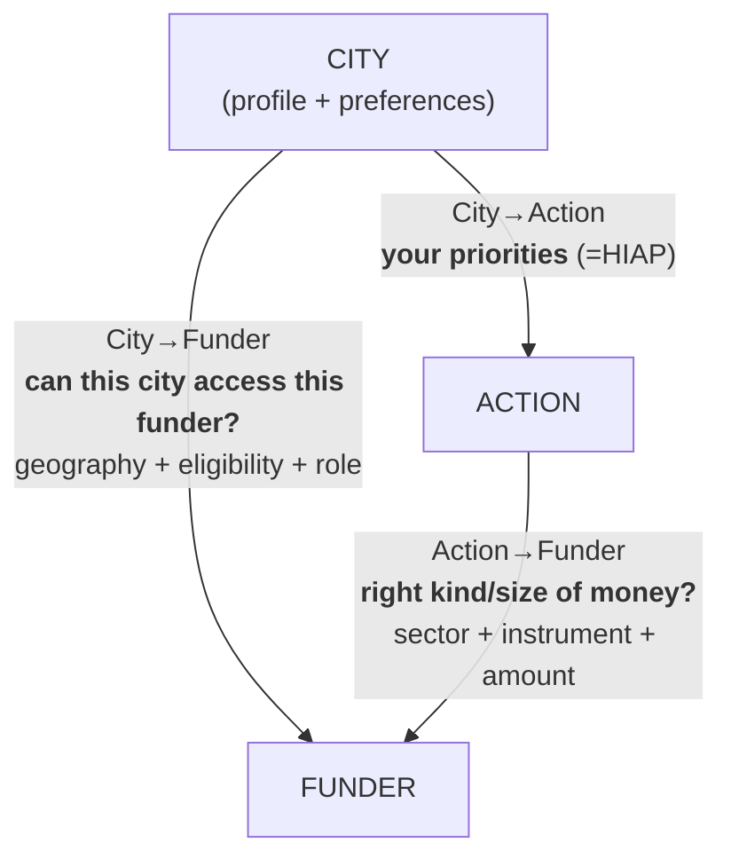

# City ↔ Funder Matching Engine

*Unlock the Money — Idea #3. Cities have needs, funders have instruments, and the matching is manual today. This is a recommendation engine that matches a city's climate actions to the funding instruments it can realistically pursue — a premium CityCatalyst feature / data service.*

Example country: **Chile**. Example city: **Valdivia**. Built on OEF's existing Chile climate-finance work (78-fund inventory + coverage indicator).

## The model — 3 entities, 3 alignments



A **match** is when all three align. But each edge is useful alone, and a *broken* edge names the gap. **We focus on the two funding edges** (City→Action is HIAP's job, already solved).

- **City→Funder** — action-agnostic, once per city. Geography (national / regional-GORE / enrolment) × city eligibility, with a **role**: *applicant / facilitator / referrer*. → "funders open to you."
- **Action→Funder** — city-agnostic, country-level, reusable across all cities. Sector fit × instrument fit (amount = adequacy, flagged). → "financing playbook" per action type.
- **Linchpin = actor eligibility.** The actor gap (a fund exists but the city can't apply) falls out naturally when the two edges *disagree*.

## What we learned about the problem space

- **Funders are transparent — but per-call, PDF-bound, ephemeral.** Eligibility, exact amounts, scoring rubrics and even award lists live in each call's *Bases* document, not in a feed. A single Bases PDF (FPA 2026) yields nearly every dimension we need. The fix is a **live per-call enrichment**, not a static re-harvest.
- **Application windows are short** (~3–6 weeks; 31/78 funds annual, only ~22 open at any moment) → cities must be *pre-staged*, not just well-matched. Readiness is a real dimension.
- **City profiles (HIAP `/prioritize` payloads) give GPC-subsector emissions** but **population is null** and most rural comunas are **net carbon sinks** (forestry) → weight matching by *gross sectoral* emissions, not net.
- **Licensing:** surface *facts* (not verbatim PDFs), attribute + link, don't mirror. Constraints are narrow — CORFO is CC BY-NC-ND (commercial-sensitive), fondos.gob.cl is index-only. One legal sign-off before shipping.

## Prototype (works today, stdlib Python)

Computes both funding edges separately and closes the triangle on real data. Valdivia results:
- **City→Funder:** 52 funds the city can apply to directly · 1 it facilitates (Casa Solar) · 25 referrer-only (the FPA family + CORFO firm instruments).
- **Action→Funder:** energy/waste/afolu well-served by grants; **transport has no dedicated instrument** (gap); industry is served only via **firm-actor** CORFO → flagged "refer local firms."

## Product ideas (the differentiators)

- **Pool cities** — aggregate comunas (e.g. a region, via a municipal association / FNDR) to clear funder thresholds none could alone.
- **Bundle actions** — combine small actions into one financeable package, or stack instruments across a project's lifecycle (TA grant → loan → guarantee).
- Both are the same move on different axes; the edges define what's *legally* poolable/bundlable. The 2D combo (pool cities × bundle actions) = a regional programmatic package (IDB/FNDR-style).


## Team & roles (4)

| Role | Owns | Deliverable |
|------|------|-------------|
| Supply / Action→Funder | fund inventory + Bases enrichment | the "financing playbook" |
| Demand / City→Funder | city profiles + eligibility/geography | "funders open to you" |
| Engine / Integration | shared schema, loaders, combine, validation | the running engine |
| Product / Demo | UI, revenue angle, app-draft generator, pitch | the 5-min demo |

**Coordination artifact:** a shared data contract (`City`, `Action`, `Fund` schemas) owned by Integration; the two edge-owners build against it in parallel.

## Scaffolding

```
city–funder-matching/
├── README.md          ← this file
├── research/          ← problem framing · tripartite model · investigations · findings
├── data/
│   ├── raw/           ← source snapshots / pointers (+ licence tags)
│   └── processed/     ← inventory · city profiles · samples
├── src/               ← loaders · edges (city_funder, action_funder) · combine · scoring
└── outputs/           ← generated matches + edge CSVs
```

Full working notes, prototype, and per-question deep-dives are in the OEF data repo under `dataset-review/reviews/oef/hack-day/` — migrate the relevant pieces into `research/`, `src/`, `data/`, `outputs/` here.
