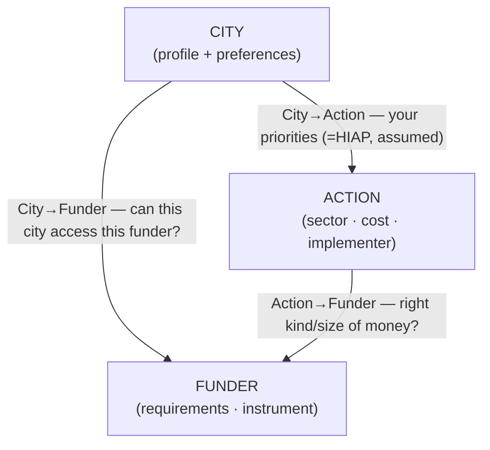

# Problem & model

**Cities have needs, funders have instruments, and the matching is manual today.** A city officer asks, fund by fund: *"we want to do X — who would pay for it, and could we actually get it?"* It's slow, expertise-bound, and doesn't scale. We build the engine that does it automatically.

## The unit of a match

Not a fund, not a city — a **triple**: `(city, action, instrument)`.

- **City** — a place with an emissions profile, a region, a size, and preferences.
- **Action** — a concrete climate action the city wants to take (the *need*).
- **Instrument** — a fund/program with eligibility, an instrument type, a sector scope, and a window (the *supply*).

A *recommendation* is a ranked shortlist of instruments for a (city, action). A *city funding profile* is that rolled up across the city's whole plan.

## What "a good match" means

> Money of the **right kind and size**, from a funder whose **mandate covers this action**, **open to an applicant of the city's type**, **in the city's place**, on a **usable timeline**, that the city has a **realistic chance of winning and capacity to use**.

Seven dimensions — not equally knowable today. Being honest about which we score vs flag is core discipline:

| Dimension | In the data today? |
|-----------|--------------------|
| Sector fit | 🟢 yes (both sides tagged) |
| Actor / eligibility | 🟡 funder side yes; city implementer inferred |
| Instrument-type fit | 🟡 heuristic |
| Timing / usability | 🟢 yes |
| Geography | 🟡 needs a city→region join |
| **Adequacy (amount)** | 🔴 fund amounts mostly absent |
| **Competitiveness / capacity** | 🔴 needs award history |

## Three entities, three alignments

A full match is when all three align — but **each edge is useful on its own**, and a *broken* edge names the gap.

### We focus on the two funding edges

City→Action is already solved — that's CityCatalyst's HIAP prioritisation. The novel work is the two edges that touch the funder.

**City → Funder** — *"can this city work with this funder at all?"*
Action-agnostic, computed **once per city**, stable over time.
- **Geography:** national · regional/GORE · enrolment.
- **Eligibility + role:** **applicant** · **facilitator** · **referrer**.
- Output → **"funders open to you."**

**Action → Funder** — *"is this the right kind and size of money?"*
City-agnostic, computed **once at country level**, reusable across every city.
- **Sector fit** × **instrument-type fit** × **adequacy** (amount, flagged when absent).
- Output → a **"financing playbook"** per kind of action.

### The linchpin: actor eligibility

"Eligible actor" is a funder property; "who implements this action" is a city/action property. The **actor gap** — a fund exists but the city can't apply because the real implementer is a firm/household — falls out when the two edges **disagree** (Action→Funder strong, City→Funder = referrer). Example: industrial actions match CORFO on sector, but CORFO funds *firms*, so the city's route is "refer local firms," not "apply."

## Pooling and bundling

The engine matches *units* — and a unit can be aggregated before matching:
- **Pool cities** (City axis) — combine comunas via a municipal association / FNDR to clear thresholds none could alone.
- **Bundle actions** (Action axis) — combine small actions into one financeable package, or stack instruments across a project's lifecycle.

The edges define what's *legally* aggregatable. The 2D combo = a regional programmatic package (IDB/FNDR-style). Deep dives: [`04-action-coordination.md`](./04-action-coordination.md), [`05-bundling-synthesis.md`](./05-bundling-synthesis.md), [`06-national-bundles.md`](./06-national-bundles.md).

## Combination logic

City→Funder access acts as a soft gate (show indirect routes rather than dropping); then rank by City→Action priority × Action→Funder fit. Always show the per-edge breakdown so a low score is explained by *which* edge failed.

## Why it matters (revenue)

The event theme is *trust*: if funders can't trust cities, money doesn't move. This engine is the matching/trust layer — a premium CityCatalyst capability for cities and consultancies, and a data service ("funders open to you", fundability scoring) for funders. OEF becomes infrastructure in the deal flow.
