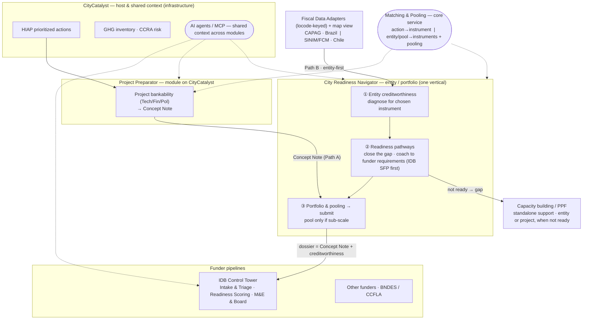

# Integrated architecture — OEF urban climate-finance stack

**Purpose:** define how the hackday modules fit into one coherent system, so the
city-facing app (City Readiness Navigator) is built against the right boundaries.
**Status:** proposal for review (12–14 Jun 2026). Pairs with
[`ITERATION-2.1-PLAN.md`](ITERATION-2.1-PLAN.md).

---

## 1. The core principle — two readiness questions, kept modular

Martin's call (validated by the Project Preparator POC): **separate whether a
*project* is bankable from whether a *city* is creditworthy.** They are different
questions, answered by different modules, and a city can enter from either side.

| | **Project bankability** | **Entity creditworthiness** |
|---|---|---|
| Question | "Is *this project* fundable, and by whom?" | "Can *this city/pool* take on *this instrument*?" |
| Object | a single project (from a HIAP action) | a subnational government (or a pool of them) |
| Owner today | **Project Preparator** (NBS Project Builder) | **justagiraffe** Readiness Engine + profiles |
| Model | Technical / Financial / Political (0.4/0.4/0.2) | creditworthiness / fiscal / legal / governance |
| Output | GCF/C40-style **Concept Note** | scored candidate + clearance for an instrument |
| Entry path | "I have a project → who funds it?" | "Can I access IDB SFP → which projects do I take on?" |

A project can be bankable while the city isn't creditworthy (and vice versa), so
**both layers are needed and complementary, not redundant.** The City Readiness
Navigator is the **entity/instrument/portfolio** layer; it *consumes* prepared
projects and adds creditworthiness + pooling + the funder handoff.

## 2. Module inventory (what exists, verified)

| Module | Repo / location | Role | Status |
|---|---|---|---|
| **CityCatalyst** | `Open-Earth-Foundation/CityCatalyst` | Host: GHG inventory, **HIAP** (prioritized actions), CCRA risk, Journey Navigator module catalog, OAuth, Global API | Production |
| **Project Preparator** | `joaquinOEF/NBS-Project-Preparation` | Project bankability (Tech/Fin/Pol), project-funder matching, Concept Note | POC |
| **justagiraffe Control Tower** | hackdays `justagiraffe/control-tower` | IDB-facing: Intake & Triage, Readiness Scoring (profile-driven engine), Results/Board | Hackday |
| **City Readiness Navigator** | hackdays `apps/city-readiness-navigator` | City-facing: the 7-step journey; entity readiness + pooling + submit | Hackday (ours) |
| **City-Funder Matching Engine** | hackdays `city–funder-matching` + `apps/funder-scan` | **Chile** capacity (SINIM/FCM), action→funder matching, **pooling/aggregation** | Hackday |
| **CAPAG Funder Scan** | hackdays `apps/capag-funder-scan` | **Brazil** creditworthiness (Treasury CAPAG A/B/C/D for 5,570 munis) | Hackday |
| **Political-will signal** | hackdays `codex/8-political-will-score` | LLM-derived governance/political-will sub-score from news/articles | Hackday (early) |

> The Matching Engine has no new commits since 12 Jun (`feat: funder matcher`).
> CAPAG and the political-will branch are the meaningful new inputs.

## 3. The data layer — country-specific fiscal sources feed one readiness model

The entity-creditworthiness pillars should be fed by **real national fiscal data
via per-country adapters**, all keyed by **UN/LOCODE**:

| Country | Source | Real signals | → pillars |
|---|---|---|---|
| **Brazil** | **CAPAG** (Tesouro Nacional, ODbL) | `capag` A+/A/B+/B/C/D · `ind1_endividamento` (debt/RCL) · `ind2_poupanca` · `ind3_liquidez` · `icf` (accounting quality) · `publicou_rgf/rreo` | creditworthiness ← capag · fiscalHealth ← ind1/2/3 · governance ← icf + transparency · legalCapacity ← A/B gates Union-guaranteed credit |
| **Chile** | **SINIM / FCM** (via Matching Engine) | `composite_score` · `fcm_dependency_pct` · `professionalization_pct` · `cofinance_score` | fiscalHealth ← composite · governance ← professionalization · (estimated creditworthiness) |
| **(any)** | **Political-will** branch | LLM article-derived signal | governance / political-will modifier |

**CAPAG is the strongest fit:** it's a *real Treasury creditworthiness rating* that
explicitly gates **Union-guaranteed credit** — the exact analog of the IDB SFP
"borrow without sovereign guarantee" question. A/B = bankable; C/D = blocked from the
federal-guarantee channel (grants/blended); n.d. = unrated (TA first). 99.96%
LOCODE-matched to CityCatalyst. *(Screening signal, not a credit decision — keep STN's
disclaimer.)*

**Architecture implication:** introduce a **Fiscal Data Adapter** interface. Each
country implements `locode → { pillar inputs, provenance }`. Brazil=CAPAG, Chile=SINIM.
The readiness engine consumes the normalized output; the UI badges provenance.

## 4. The shared spine (what every surface reuses)

1. **Readiness framework** — one pluggable system, **two levels of profile**:
   - *Project profiles* (Preparator: Tech/Fin/Pol per funder type).
   - *Entity/instrument profiles* (justagiraffe: IDB SFP #1; CAF/WB/GCF next).
   Extract as a shared package so there aren't 3 divergent models.
2. **Fiscal Data Adapters** (§3) — CAPAG, SINIM, …
3. **Funder/instrument catalog** — today split (Preparator's 18 LatAm instruments;
   Matching Engine's Chile funds; CAPAG's BNDES/CCFLA angle). Converge to one catalog
   with eligibility metadata (borrower type, ticket window, sovereign-guarantee flag).
4. **Candidate dossier = the Concept Note, extended** — the machine-readable handoff
   into a funder pipeline. Reuse the Preparator's GCF/C40 Concept Note and add the
   entity-creditworthiness + instrument + pooling layer; don't invent a new schema.
5. **CityCatalyst host** — inventory + HIAP supply the *what to fund*; the Journey
   Navigator surfaces each module; OAuth + Global API + `locode`/`cityId` are the joins.

## 5. End-to-end flow (both entry paths on one spine)

```
CityCatalyst:  GHG inventory ──┐         ┌── CCRA climate risk
                               ▼         ▼
                         HIAP prioritized actions
                               │
        ┌──────────────────────┴───────────────────────┐
   PATH A (project-first)                        PATH B (capacity-first)
        │                                               │
  Project Preparator                          City Readiness Navigator
  • Tech/Fin/Pol bankability                  • "Can I access IDB SFP?"
  • project funders / PPFs                    • entity creditworthiness
  • Concept Note  ───────────────┐            • pick instrument / projects
                                 ▼            │
                    City Readiness Navigator (entity / portfolio layer)
                    • entity readiness  ◀── Fiscal Data Adapter (CAPAG / SINIM)
                    • pool to reach ticket size (Matching Engine)
                    • build dossier (= Concept Note + creditworthiness)
                                 │ submit
                                 ▼
                    Funder pipelines
                    • justagiraffe Control Tower (IDB Intake & Triage)
                    • CAPAG/BNDES-CCFLA funder screening (other funders)
```

## 5a. Diagram (Mermaid — canonical, renders on GitHub)



> **Module hierarchy:** Preparator and Navigator are drawn as **peer modules on the
> CityCatalyst host** (intended end-state — the Preparator is a separate-repo POC today,
> `joaquinOEF/NBS-Project-Preparation`). **Navigator = one vertical, three steps:**
> ① diagnose entity creditworthiness → ② readiness pathways (close the gap / coach to the
> funder's requirements, IDB SFP first) → ③ portfolio & pooling (pool only if sub-scale) →
> submit. **Capacity building / PPF is a standalone support track** reached from a "not
> ready" diagnosis — not wired into the Preparator. Path A (a Concept Note) enters at ③;
> Path B (entity-first) enters at ①.

> Refinements behind this diagram (matching-as-core-service, entity-first naming,
> capacity-building as a branch, single-vertical Navigator, AI-agent context) are detailed in
> [`ITERATION-2.1-PLAN.md` §F–G](ITERATION-2.1-PLAN.md).

> **Polished renders for presenting** (open & screenshot): the module-boundary view
> [`diagrams/5a-integrated-architecture.svg`](diagrams/5a-integrated-architecture.svg) and the
> pipeline view [`diagrams/process-timeline.svg`](diagrams/process-timeline.svg). See
> [`diagrams/README.md`](diagrams/README.md). The mermaid above remains the source of truth.

## 6. Module boundaries & contracts (to agree)

- **HIAP → Preparator / Navigator:** prioritized actions (`actionId`, sector, type).
- **Fiscal Data Adapter → Readiness Engine:** `locode → {creditworthiness, fiscalHealth, legalCapacity, governance, provenance}` (CAPAG & SINIM implementations).
- **Preparator → Navigator:** a prepared project / Concept Note object.
- **Matching Engine → Navigator:** funders-open per action + pool/aggregation candidates.
- **Navigator → Control Tower:** the candidate **dossier** (Concept Note + creditworthiness + instrument + pool), written into Intake & Triage.

## 7. What's real today vs. to-build

- **Real now:** CityCatalyst inventory/HIAP/CCRA; CAPAG (5,570 munis); SINIM/FCM (Chile);
  Preparator readiness + Concept Note; justagiraffe profile-driven engine; Navigator 7-step
  flow + handoff.
- **To build (v2.1+):** Fiscal Data Adapter interface (CAPAG + SINIM); shared readiness
  package; Concept-Note-as-dossier; converged funder catalog; the two explicit entry paths.

## 8. Open decisions (for the review)

1. **Shared readiness package** — extract now (de-dupe Navigator/Control Tower), or after the hackday?
2. **Dossier = Concept Note** — adopt the Preparator's Concept Note as the handoff format?
3. **Funder catalog** — one converged catalog, or keep per-team for now and map later?
4. **CAPAG integration depth** — wire CAPAG as the Brazil adapter for a second hero city (e.g. a Brazilian municipality alongside Valdivia), to prove the multi-country pillar feed?
5. **Where the Navigator lives** — sibling CityCatalyst module sharing the spine (recommended).
