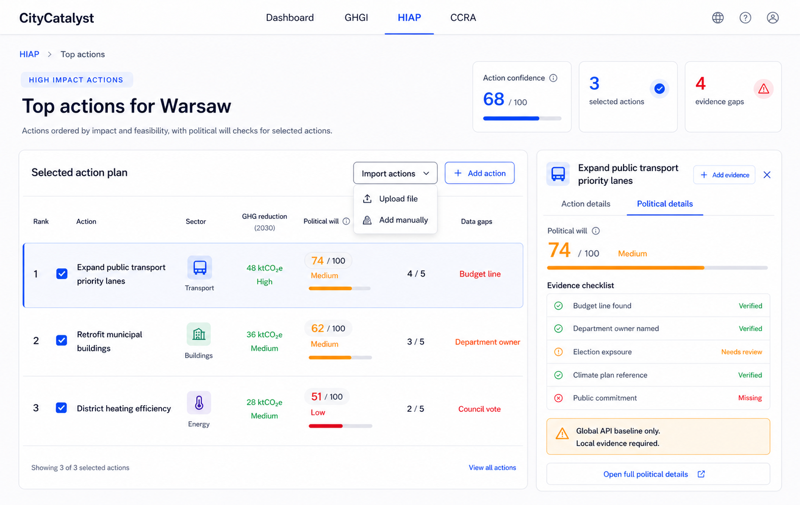
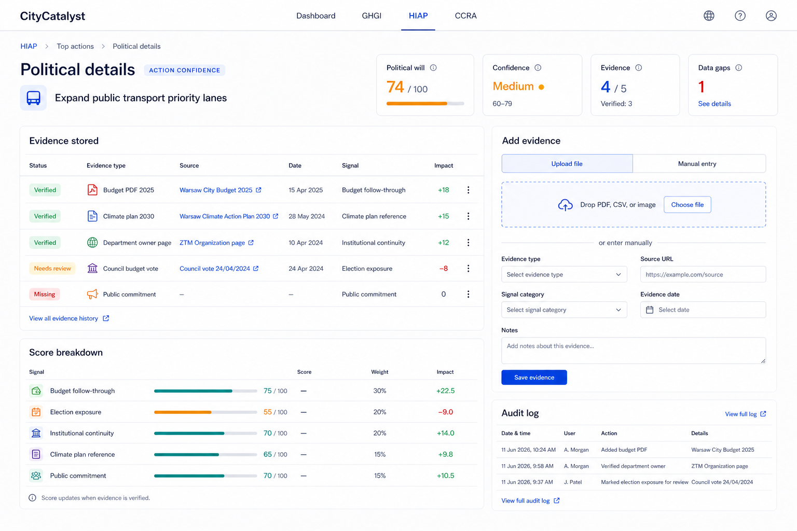

# Political Will Score Implementation Plan

## Direction

Political Will Score should be implemented as an extension of the CityCatalyst HIAP workflow, not as a separate standalone dashboard.

HIAP already answers:

> Which climate actions should this city prioritize?

Political Will Score adds:

> For the actions this city has selected or agreed to pursue, how likely are they to survive political, budget, and institutional change?

This makes the feature action-level and implementation-focused. It fits beside the existing HIAP action ranking, selected actions, action details drawer, generated action plans, and export workflow.

## Mockups

### 1. HIAP Political Will Action Confidence



This screen adds political confidence directly to the selected HIAP action list.

Core changes shown:

- `Import actions` menu with:
  - `Upload file`
  - `Add manually`
- `Add action` button for direct manual creation.
- `Action confidence` summary metric across selected actions.
- `Political will` column for each selected action.
- `Evidence` count per action.
- `Data gaps` column with the most important missing proof.
- Right-side action inspector with:
  - `Action details`
  - `Political details`
  - compact `Add evidence` button near the top
  - action-level political evidence checklist
  - Global API caveat

### 2. Political Details Evidence Management



This screen is the full evidence workspace for one action.

It allows the user to:

- View the action-level political will score.
- See confidence, evidence count, and data gap count.
- Review stored evidence.
- Upload evidence files.
- Add evidence manually.
- See how evidence affects the score.
- View an audit log of evidence changes.

## User Flow

1. User opens HIAP for a city.
2. HIAP shows ranked and selected actions.
3. User imports additional agreed actions if needed:
   - upload file
   - add manually
4. User selects or reviews agreed actions.
5. Each action receives a Political Will score.
6. User opens `Political details` for an action.
7. User adds or verifies evidence.
8. Score and confidence update when evidence is verified.
9. User exports or shares the action plan with political confidence included.

## MVP Screens

### HIAP Action Confidence Screen

Route concept:

```text
/cities/:cityId/HIAP/:inventoryId
```

This can initially live inside the existing HIAP tab rather than a new route.

Main areas:

- Page header: existing HIAP style.
- Summary tiles:
  - Action confidence
  - Selected actions
  - Evidence gaps
- Selected action table.
- Right action inspector.
- Import action menu.

### Political Details Screen

Route concept:

```text
/cities/:cityId/HIAP/:inventoryId/actions/:actionId/political-details
```

For hackday speed, this can also be a modal or drawer state instead of a real route.

Main areas:

- Header with action name and score.
- Summary metrics.
- Stored evidence table.
- Add evidence panel.
- Score breakdown.
- Audit log.

## Components

Recommended components:

```text
PoliticalWillActionConfidence
PoliticalWillSummaryTiles
SelectedActionPlanTable
ImportActionsMenu
PoliticalActionInspector
PoliticalWillScore
EvidenceChecklist
PoliticalDetailsPage
EvidenceStoredTable
AddEvidencePanel
ScoreBreakdown
AuditLog
```

### `SelectedActionPlanTable`

Extends the HIAP ranked/selected actions table with three new columns:

| Column | Purpose |
| --- | --- |
| Political will | Shows action-level score and confidence category |
| Evidence | Shows verified evidence count out of expected evidence |
| Data gaps | Shows the highest-priority missing proof |

The table should keep the existing HIAP behavior:

- rows can be selected
- action drawer can open
- export can still work
- selected actions remain the source of the action plan

### `PoliticalActionInspector`

Right-side inspector for the selected action.

It should include:

- Action title.
- Small `Add evidence` button near the title.
- `Action details` and `Political details` tabs.
- Political will score.
- Evidence checklist.
- Global API caveat.
- Link to open the full political details screen.

### `AddEvidencePanel`

Supports two modes:

- `Upload file`
- `Manual entry`

Upload file MVP:

- PDF, CSV, image, or document upload placeholder.
- File name, status, and extracted text can be mocked at first.

Manual entry MVP:

- Evidence type.
- Source URL.
- Signal category.
- Evidence date.
- Notes.
- Save evidence.

## Data Model

### Action Confidence

Each selected action should have political confidence metadata.

```ts
type PoliticalWillActionScore = {
  actionId: string;
  cityId: string;
  locode: string;
  score: number;
  confidence: "low" | "medium" | "high";
  evidenceComplete: number;
  evidenceExpected: number;
  topDataGap: string | null;
  signals: PoliticalWillSignal[];
  evidence: PoliticalWillEvidence[];
  auditLog: PoliticalWillAuditEvent[];
};
```

### Signal

```ts
type PoliticalWillSignal = {
  key:
    | "budgetFollowThrough"
    | "electionExposure"
    | "institutionalContinuity"
    | "climatePlanReference"
    | "publicCommitment";
  label: string;
  weight: number;
  score: number;
  status: "verified" | "needs_review" | "missing";
  evidenceIds: string[];
};
```

### Evidence

```ts
type PoliticalWillEvidence = {
  id: string;
  actionId: string;
  cityId: string;
  type:
    | "budget_pdf"
    | "climate_plan"
    | "department_owner"
    | "council_vote"
    | "mayor_press_release"
    | "manual_note"
    | "other";
  sourceName: string;
  sourceUrl?: string;
  fileName?: string;
  signalKey: PoliticalWillSignal["key"];
  status: "verified" | "needs_review" | "missing";
  impact: "positive" | "negative" | "neutral";
  evidenceDate?: string;
  notes?: string;
  createdAt: string;
  updatedAt: string;
};
```

### Audit Event

```ts
type PoliticalWillAuditEvent = {
  id: string;
  actionId: string;
  actorName: string;
  eventType:
    | "evidence_added"
    | "evidence_verified"
    | "evidence_marked_needs_review"
    | "score_recalculated";
  message: string;
  createdAt: string;
};
```

## Scoring

Action-level Political Will score should use five signals:

| Signal | Weight | Meaning |
| --- | ---: | --- |
| Budget follow-through | 30% | Is the action reflected in budget or procurement evidence? |
| Election exposure | 20% | Is the action likely to survive the next political cycle? |
| Institutional continuity | 20% | Is there a named owner, department, or implementation body? |
| Climate plan reference | 15% | Is the action included in an adopted climate/action plan? |
| Public commitment | 15% | Has leadership publicly committed to the action? |

Formula:

```ts
score =
  budgetFollowThrough * 0.3 +
  electionExposure * 0.2 +
  institutionalContinuity * 0.2 +
  climatePlanReference * 0.15 +
  publicCommitment * 0.15;
```

Confidence should be separate from score.

```ts
confidenceRatio = verifiedEvidenceCount / expectedEvidenceCount;
```

Suggested labels:

| Ratio | Label |
| ---: | --- |
| `>= 0.8` | High |
| `>= 0.4` | Medium |
| `< 0.4` | Low |

This prevents a weakly sourced score from looking more certain than it is.

## Imports

### Upload File

Supported hackday MVP formats:

- CSV
- PDF
- image
- plain text

MVP behavior:

1. User selects file.
2. App records file metadata.
3. App shows it as `Needs review`.
4. User manually assigns:
   - evidence type
   - signal category
   - status
   - impact
5. Score recalculates after status becomes `Verified`.

Later behavior:

- Extract text from PDFs.
- Use AI to suggest evidence category.
- Link extracted claims to score impact.
- Keep reviewer approval as the final step.

### Add Manually

Manual action import should support:

- action title
- sector
- expected GHG impact
- source or plan reference
- notes

Manual evidence entry should support:

- evidence type
- source URL
- signal category
- evidence date
- notes

## Backend Options

### Hackday Fast Path

Use local static data:

```text
src/data/political-will.ts
```

Pros:

- fastest to build
- easy to demo
- no migrations
- no auth complexity

Cons:

- not persistent
- no real upload storage
- no multi-user audit trail

### Production Path

Add database tables:

```text
political_will_action_score
political_will_evidence
political_will_audit_event
```

Pros:

- persistent
- auditable
- can support file uploads and reviewer workflows

Cons:

- needs migrations
- needs API endpoints
- needs permissions

## API Shape

Possible endpoints:

```text
GET    /api/v1/city/:cityId/hiap/actions/:actionId/political-will
POST   /api/v1/city/:cityId/hiap/actions/:actionId/political-will/evidence
PATCH  /api/v1/city/:cityId/hiap/actions/:actionId/political-will/evidence/:evidenceId
POST   /api/v1/city/:cityId/hiap/actions/import
POST   /api/v1/city/:cityId/hiap/actions/import-file
```

For hackday, these can be mocked in frontend state.

## Integration With Existing HIAP

The best integration point is the existing selected actions workflow.

Current HIAP concepts to reuse:

- ranked actions
- selected actions
- unranked actions
- action drawer
- generated action plan
- CSV/PDF export

Political Will should add:

- action-level score
- evidence completeness
- data gap labels
- political details view
- evidence upload/manual entry

It should not replace:

- HIAP ranking
- mitigation/adaptation action logic
- action plan generation

## Implementation Steps

### Step 1: Static Data

Create static mock data for:

- Warsaw
- three selected actions
- political scores for each action
- evidence checklist
- stored evidence
- audit log

### Step 2: Extend HIAP Table UI

Add columns:

- Political will
- Evidence
- Data gaps

Keep the current ranked/selected action table behavior.

### Step 3: Add Political Action Inspector

Add the right drawer with:

- action title
- `Add evidence`
- tabs for `Action details` and `Political details`
- checklist
- Global API caveat

### Step 4: Add Political Details Screen

Add evidence management view:

- stored evidence table
- upload file mode
- manual entry mode
- score breakdown
- audit log

### Step 5: Add Score Calculation

Create a small scoring helper:

```text
src/lib/political-will/scoring.ts
```

It should calculate:

- weighted action score
- evidence completeness
- confidence label
- top data gap

### Step 6: Add Import Actions

Implement two frontend flows:

- `Upload file`
- `Add manually`

For the hackday, file upload can remain local/mock until persistence is needed.

### Step 7: Demo Polish

Demo path:

1. Open HIAP top actions for Warsaw.
2. Show selected action plan.
3. Point out political will column.
4. Open Political details for the transport action.
5. Add evidence manually or upload a sample file.
6. Show score/confidence update.
7. Explain that Global API is baseline only and local evidence drives trust.

## Acceptance Criteria

- User can see Political Will score per selected HIAP action.
- User can see evidence count and top data gap per action.
- User can open Political details for an action.
- User can add evidence manually.
- User can upload a file placeholder.
- Stored evidence appears in the evidence table.
- Score breakdown is visible and understandable.
- Confidence is shown separately from score.
- Global API caveat is visible.
- The UI feels like part of CityCatalyst HIAP.

