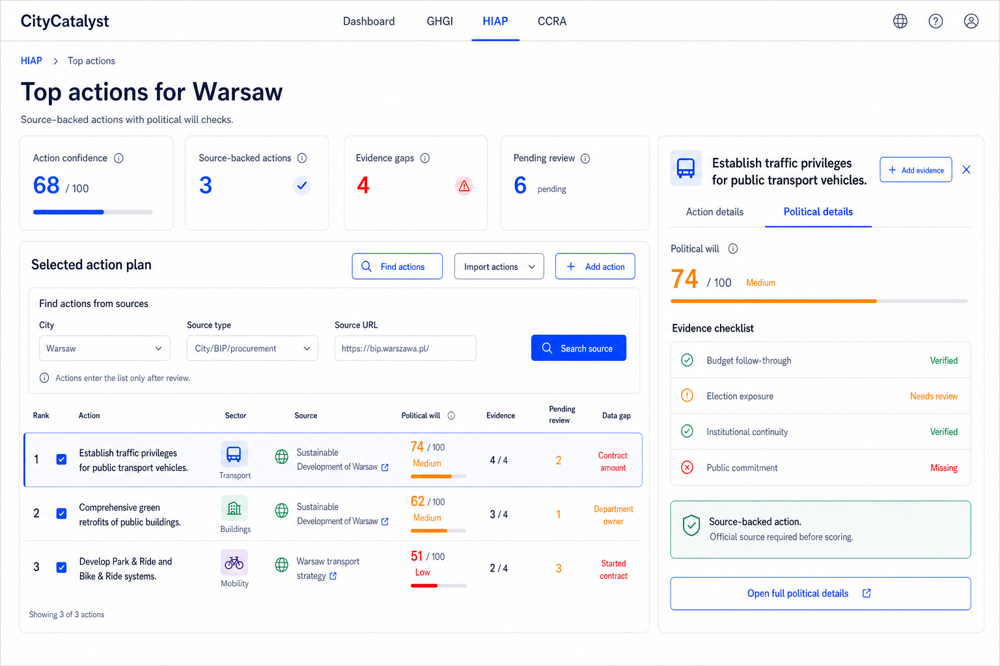
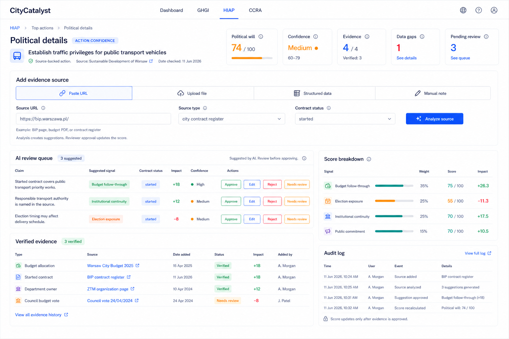

# Political Will Score Implementation Plan

## Direction

Political Will Score should be implemented as an extension of the CityCatalyst HIAP workflow, not as a separate standalone dashboard.

HIAP already answers:

> Which climate actions should this city prioritize?

Political Will Score adds:

> For the actions this city has selected or agreed to pursue, how likely are they to survive political, budget, and institutional change?

This makes the feature action-level and implementation-focused. It fits beside the existing HIAP action ranking, selected actions, action details drawer, generated action plans, and export workflow.

## Product Design Flow Audit Adjustments

The screen concepts cover the right surface area, but the user flow needs two stronger product rules:

> Evidence is not just uploaded. It is collected, analyzed, reviewed, and then applied to the score.
> Actions and evidence must be real and source-backed before they enter the product dataset.

The improved flow should make five things obvious:

1. Users can import actions from a file or add them manually.
2. Users can add political evidence from online sources, city procurement/contract pages, uploaded documents, structured data, articles, or notes.
3. An LLM can analyze those inputs and suggest claims, signal mapping, score impact, and confidence.
4. A human reviewer must approve extracted evidence before it changes the Political Will score.
5. Users can correct discovered actions and sources when they have better evidence.

This keeps the product useful without letting AI silently change funder-facing scores.

## Screen Concepts

### 1. HIAP Political Will Action Confidence


This screen adds political confidence directly to the selected HIAP action list.

Core changes shown:

- `Import actions` menu with:
  - `Upload file`
  - `Add manually`
- `Add action` button for direct manual creation.
- `Action confidence` summary metric across selected actions.
- `Political will` column for each selected action.
- `Evidence` count per action.
- `Data gaps` column with the most important missing proof.
- Right-side action inspector with:
  - `Action details`
  - `Political details`
  - compact `Add evidence` button near the top
  - action-level political evidence checklist
  - Global API caveat

### 2. Political Details Evidence Management


This screen is the full evidence workspace for one action.

It allows the user to:

- View the action-level political will score.
- See confidence, evidence count, and data gap count.
- Add online sources, city procurement/contract pages, uploaded files, structured data, or manual notes.
- Review AI-extracted claims before they affect the score.
- Review stored evidence and rejected suggestions.
- See how evidence affects the score.
- View an audit log of evidence changes.

### 3. HIAP Political Will Action Confidence V2



This standalone V2 screen keeps the HIAP view focused on real source-backed action discovery:

- `Find actions` entry point for city, BIP, procurement, contract, and uploaded sources
- selected actions only after source review
- source-backed action status in the table
- four-signal political evidence checklist
- no climate-plan maturity signal

### 4. Political Details Evidence Management V2



This standalone V2 screen makes the in-depth evidence workflow clearer:

- source intake for URL, file upload, structured data, and manual notes
- city contract/procurement source handling
- AI suggestions separated from verified evidence
- contract status visible on suggested evidence
- score updates tied to reviewer approval

## User Flow

1. User opens HIAP for a city.
2. HIAP shows ranked and selected actions.
3. User imports additional agreed actions if needed:
   - upload file
   - add manually
4. User selects or reviews agreed actions.
5. Each selected action receives an initial Political Will score based on available evidence.
6. User opens `Political details` for an action.
7. User adds evidence through one of four intake paths:
   - paste URL / fetch online source, including city procurement or contract pages
   - upload document or article
   - upload structured data, including contract register exports
   - write manual note
8. The app analyzes the source with an LLM and produces suggested evidence:
   - extracted claim
   - relevant signal
   - score impact
   - confidence
   - missing context
9. User reviews the AI suggestion and chooses:
   - approve
   - edit
   - reject
   - mark as needs review
10. Score and confidence update only after evidence is approved or verified.
11. User exports or shares the action plan with political confidence included.

## Revised Decision Workflow

Political Will should behave like an evidence review queue, not a black-box score generator.

```text
Source intake
  -> AI extraction
  -> Human review
  -> Verified evidence
  -> Score recalculation
  -> Audit log
```

### Source Intake

Users should be able to add sources from:

| Intake method | Example | MVP behavior |
| --- | --- | --- |
| Online URL | City budget page, BIP page, city contract register, planned contract page, started contract page, news article | Fetch title/content where possible; otherwise store URL for manual review |
| File upload | PDF, CSV, image, doc, article export | Store file metadata and extracted text from the real uploaded file |
| Structured data | CSV budget lines, contract register exports, action tracker exports | Parse rows into candidate evidence records |
| Manual note | Analyst note from a meeting or phone call | Store note as unverified evidence until reviewed |

### Political Climate And News Monitoring

Political Will also needs a recurring internet/news research path for newest articles and changes in the local political climate.

Sources:

- official city news and announcements
- BIP/council updates
- local media articles
- procurement and contract updates
- mayor/council statements
- election news and candidate commitments
- public controversy, delays, cancellations, protests, or budget cuts

Search controls:

- city
- selected action
- keywords
- source type
- recency window: last 7 days, last 30 days, last 90 days, since last review
- language
- include official sources only toggle

Output should be a review queue, not direct evidence.

Each finding should show:

- title
- source
- date published or date checked
- source URL
- extracted political signal
- suggested signal mapping
- suggested impact
- confidence
- reviewer action

News findings should affect score only after reviewer approval.

### Contract Evidence Flow

Cities often publish planned, current, and started contracts on dedicated procurement, investment, or BIP pages. Those sources should be treated as a first-class path for budget follow-through evidence.

Contract evidence should capture:

- contract title
- contract status: planned, tendered, awarded, current, started, completed, or cancelled
- source page or register URL
- amount and currency when available
- procurement ID or contract ID when available
- responsible department or contracting authority
- contractor when available
- start date or expected start date
- mapped HIAP action

Evidence strength should depend on status:

| Contract status | Political Will meaning |
| --- | --- |
| Planned | Early implementation intent; useful but weaker until budget or tender evidence exists |
| Tendered / awarded | Stronger budget follow-through signal, especially with amount and department |
| Current / started | Strong implementation momentum if the scope clearly maps to the action |
| Completed | Useful delivery evidence, but should not overstate future political durability |
| Cancelled | Negative evidence for budget follow-through |

### Real Action Discovery

The product should help the user find real actions for each city from source-backed research.

Discovery sources:

- official city action plans and investment pages
- HIAP-generated or imported action files provided by the user
- BIP pages and public information bulletins
- procurement portals and contract registers
- city budget resolutions and annexes
- project delivery pages and implementation reports

Rules:

- An action must have an action source before it can appear in the selected action list.
- The action source must be visible on the action detail screen.
- The user can edit the action title, sector, and notes, but the original discovered source remains in history.
- The user can replace the action source if the first source is wrong or weak.
- If a city has no confirmed source-backed actions yet, show an empty state asking the user to search, paste a source URL, or upload a document.

### Real Search UX

Add a `Find actions` or `Add from source` entry point before the selected action list is populated.

The search flow should:

1. Let the user choose a city.
2. Search official or user-provided sources.
3. Show candidate actions with source name, source URL or file, extracted excerpt, date checked, and confidence.
4. Let the user accept, edit, reject, or merge candidates.
5. Keep rejected candidates in source history, excluded from the action list.
6. Let the user re-run extraction after replacing a weak source with a better one.

The app should not silently add action rows from search results. User review is required.

### AI Analysis

The LLM should analyze a source and return suggested evidence, not final truth.

Suggested output:

```json
{
  "claim": "A started 2025 contract covers design work for bus priority lane expansion.",
  "signalKey": "budgetFollowThrough",
  "impact": "positive",
  "suggestedScoreDelta": 8,
  "confidence": "medium",
  "needsHumanReview": true,
  "reasoning": "The source appears to show a started contract tied to the selected transport action, but the contract scope and start date should be verified.",
  "quotedEvidence": "Short excerpt or summary only",
  "contractStatus": "started",
  "missingContext": ["contract amount", "implementation department", "contract start date"]
}
```

### Review Gate

The app should never apply LLM output directly to the score.

| Reviewer action | Result |
| --- | --- |
| Approve | Evidence becomes verified and score recalculates |
| Edit and approve | Reviewer corrects extracted claim, then score recalculates |
| Reject | Evidence is stored but excluded from score |
| Needs review | Evidence appears in queue and does not affect score |

### Decision Support

The UI can show an AI recommendation, but it should be framed as a draft:

```text
AI suggestion: Positive evidence for budget follow-through.
Reviewer decision required before score updates.
```

## MVP Screens

### HIAP Action Confidence Screen

Route concept:

```text
/cities/:cityId/HIAP/:inventoryId
```

This can initially live inside the existing HIAP tab rather than a new route.

Main areas:

- Page header: existing HIAP style.
- Summary tiles:
  - Action confidence
  - Selected actions
  - Evidence gaps
- Selected action table.
- Right action inspector.
- Import action menu.

### Political Details Screen

Route concept:

```text
/cities/:cityId/HIAP/:inventoryId/actions/:actionId/political-details
```

For hackday speed, this can also be a modal or drawer state instead of a real route.

Main areas:

- Header with action name and score.
- Summary metrics.
- Source intake panel.
- AI extraction review panel.
- Stored evidence table.
- Score breakdown.
- Audit log.

## Components

Recommended components:

```text
PoliticalWillActionConfidence
PoliticalWillSummaryTiles
SelectedActionPlanTable
ImportActionsMenu
FindActionsFromSources
CandidateActionsReview
PoliticalClimateSearch
NewsFindingsReview
PoliticalActionInspector
PoliticalWillScore
EvidenceChecklist
PoliticalDetailsPage
EvidenceStoredTable
AddEvidencePanel
OnlineSourceInput
FileEvidenceUpload
StructuredDataImport
ManualNoteInput
LLMAnalysisReview
ExtractedClaimsTable
ScoreBreakdown
AuditLog
```

### `SelectedActionPlanTable`

Extends the HIAP ranked/selected actions table with three new columns:

| Column | Purpose |
| --- | --- |
| Political will | Shows action-level score and confidence category |
| Evidence | Shows verified evidence count out of expected evidence |
| Data gaps | Shows the highest-priority missing proof |

The table should keep the existing HIAP behavior:

- rows can be selected
- action drawer can open
- export can still work
- selected actions remain the source of the action plan

### `FindActionsFromSources`

Entry point for discovering real source-backed actions before they are added to the selected action list.

It should support:

- city selection
- official source URL entry
- upload source document
- structured source import
- search status
- action extraction results

### `CandidateActionsReview`

Review queue for actions extracted from real sources.

It should show:

- extracted action title
- source name and URL or file
- source excerpt
- date checked
- extraction confidence
- reviewer actions: `Accept`, `Edit`, `Reject`, `Merge`

### `PoliticalClimateSearch`

Search surface for newest political climate and local news changes.

It should support:

- city
- selected action
- keywords
- recency window
- source type
- official-only toggle
- search results status

### `NewsFindingsReview`

Review queue for articles and political updates found online.

It should show:

- article or update title
- source
- published date or date checked
- source URL
- extracted political signal
- suggested score impact
- reviewer actions: `Approve`, `Edit`, `Reject`, `Needs review`

### `PoliticalActionInspector`

Right-side inspector for the selected action.

It should include:

- Action title.
- Small `Add evidence` button near the title.
- `Action details` and `Political details` tabs.
- Political will score.
- Evidence checklist.
- Global API caveat.
- Link to open the full political details screen.

### `AddEvidencePanel`

Supports four intake modes:

- `Paste URL`
- `Upload file`
- `Upload structured data`
- `Manual note`

Paste URL MVP:

- User pastes a source URL, such as a city budget page, BIP page, council record, procurement page, city contract register, planned contract page, started contract page, implementation report, or news article.
- App stores the URL, source title when available, and analysis status.
- App offers `Analyze source` to create suggested evidence, including contract status when available.

Upload file MVP:

- PDF, CSV, image, or document upload with the real uploaded file stored or referenced.
- File name, MIME type, status, and extracted text come from the uploaded source.
- App offers `Analyze file` to create suggested evidence.

Upload structured data MVP:

- CSV or spreadsheet uploaded by the user or produced by a real source search.
- User chooses which columns represent source title, contract status, date, notes, amount, department, procurement ID, contractor, or URL.
- Rows become candidate evidence records that need review.

Manual note MVP:

- Evidence type.
- Source URL.
- Signal category.
- Evidence date.
- Notes.
- Save as `Needs review` or `Verified`, depending on reviewer permission.

### `LLMAnalysisReview`

Shows AI output as reviewable suggestions, not final evidence.

It should include:

- Extracted claim.
- Suggested signal.
- Suggested impact.
- Confidence.
- Missing context.
- Link back to the source.
- Actions: `Approve`, `Edit`, `Reject`, `Needs review`.

### `ExtractedClaimsTable`

Keeps analyzed but unapproved claims visible.

This prevents useful analysis from disappearing while still making it clear that rejected or unreviewed claims do not affect the score.

## Data Model

### Action Confidence

Each selected action should have political confidence metadata.

```ts
type PoliticalWillActionScore = {
  actionId: string;
  cityId: string;
  locode: string;
  score: number;
  confidence: "low" | "medium" | "high";
  evidenceComplete: number;
  evidenceExpected: number;
  topDataGap: string | null;
  signals: PoliticalWillSignal[];
  sources: PoliticalWillSource[];
  evidence: PoliticalWillEvidence[];
  auditLog: PoliticalWillAuditEvent[];
};
```

### Signal

```ts
type PoliticalWillSignal = {
  key:
    | "budgetFollowThrough"
    | "electionExposure"
    | "institutionalContinuity"
    | "publicCommitment";
  label: string;
  weight: number;
  score: number;
  status: "verified" | "needs_review" | "missing";
  evidenceIds: string[];
};
```

### Source

Sources are the raw materials the user provides before they become reviewed evidence.

```ts
type PoliticalWillSource = {
  id: string;
  actionId: string;
  cityId: string;
  intakeMethod: "url" | "file_upload" | "structured_data" | "manual_note";
  sourceType:
    | "budget"
    | "bip_page"
    | "news_article"
    | "council_record"
    | "procurement"
    | "contract_register"
    | "planned_contract_page"
    | "current_contract_page"
    | "started_contract_page"
    | "project_page"
    | "implementation_report"
    | "meeting_note"
    | "dataset"
    | "other";
  title: string;
  url?: string;
  fileName?: string;
  mimeType?: string;
  rawText?: string;
  analysisStatus: "not_started" | "analyzing" | "analyzed" | "failed";
  reviewStatus: "unreviewed" | "needs_review" | "reviewed";
  createdAt: string;
  updatedAt: string;
};
```

### Evidence

```ts
type PoliticalWillEvidence = {
  id: string;
  actionId: string;
  cityId: string;
  sourceId?: string;
  type:
    | "budget_pdf"
    | "department_owner"
    | "council_vote"
    | "mayor_press_release"
    | "procurement_notice"
    | "planned_contract"
    | "current_contract"
    | "started_contract"
    | "contract_award"
    | "implementation_update"
    | "news_article"
    | "dataset_row"
    | "manual_note"
    | "other";
  sourceName: string;
  sourceUrl?: string;
  fileName?: string;
  signalKey: PoliticalWillSignal["key"];
  status: "suggested" | "verified" | "needs_review" | "rejected" | "missing";
  impact: "positive" | "negative" | "neutral";
  evidenceDate?: string;
  extractedClaim?: string;
  contractStatus?: "planned" | "tendered" | "awarded" | "current" | "started" | "completed" | "cancelled";
  contractAmount?: number;
  contractCurrency?: string;
  contractStartDate?: string;
  contractorName?: string;
  procurementId?: string;
  llmReasoning?: string;
  llmConfidence?: "low" | "medium" | "high";
  reviewerNotes?: string;
  notes?: string;
  createdAt: string;
  updatedAt: string;
};
```

### Audit Event

```ts
type PoliticalWillAuditEvent = {
  id: string;
  actionId: string;
  actorName: string;
  eventType:
    | "source_added"
    | "source_analyzed"
    | "ai_suggestion_created"
    | "evidence_added"
    | "evidence_verified"
    | "evidence_marked_needs_review"
    | "evidence_rejected"
    | "score_recalculated";
  message: string;
  createdAt: string;
};
```

## Scoring

Action-level Political Will score should use four signals.

Do not score whether the action appears in a published climate or adaptation plan. Political Will starts from selected HIAP actions or an agreed plan, so plan existence is a prerequisite rather than evidence of implementation durability.

| Signal | Weight | Meaning |
| --- | ---: | --- |
| Budget follow-through | 35% | Is the action reflected in budget, procurement, planned/current/started contracts, or delivery evidence? |
| Election exposure | 25% | Is the action likely to survive the next political cycle? |
| Institutional continuity | 25% | Is there a named owner, department, or implementation body? |
| Public commitment | 15% | Has leadership publicly committed to the action? |

Formula:

```ts
score =
  budgetFollowThrough * 0.35 +
  electionExposure * 0.25 +
  institutionalContinuity * 0.25 +
  publicCommitment * 0.15;
```

Confidence should be separate from score.

```ts
confidenceRatio = verifiedEvidenceCount / expectedEvidenceCount;
```

Suggested labels:

| Ratio | Label |
| ---: | --- |
| `>= 0.8` | High |
| `>= 0.4` | Medium |
| `< 0.4` | Low |

This prevents a weakly sourced score from looking more certain than it is.

## Imports

The product needs two different import concepts:

1. Action import: brings agreed HIAP actions into the action plan.
2. Evidence intake: brings source material into one action's Political Will review.

Keeping these separate prevents a user from confusing "import action" with "use this source to change the score."

### Upload File

Supported hackday MVP formats:

- CSV
- PDF
- image
- plain text

MVP behavior:

1. User selects file.
2. App records file metadata as a `PoliticalWillSource`.
3. App shows it as `Unreviewed`.
4. User can run AI analysis.
5. App creates `Suggested` evidence records.
6. Reviewer assigns or confirms:
   - evidence type
   - signal category
   - status
   - impact
7. Score recalculates only after status becomes `Verified`.

Later behavior:

- Extract text from PDFs.
- Use AI to suggest evidence category.
- Link extracted claims to score impact.
- Keep reviewer approval as the final step.

### Paste URL / Online Source

Supported hackday MVP source types:

- budget page
- BIP/public information page
- city council record
- public procurement page
- city contract register
- planned contract page
- current contract page
- started contract page
- project delivery page
- implementation report
- news article

MVP behavior:

1. User pastes a URL.
2. App stores the URL, source type, title, and contract status if available.
3. User clicks `Analyze source`.
4. App creates suggested evidence records with source links and extracted contract metadata.
5. Reviewer approves, edits, rejects, or marks each suggestion as needs review.

If fetching source content fails, the user must paste source text or upload the source document. Do not fabricate extracted content.

### Upload Structured Data

Supported hackday MVP formats:

- CSV
- spreadsheet export
- copied table text
- contract register export

MVP behavior:

1. User uploads data.
2. User maps columns or accepts a default mapping.
3. App converts rows into suggested evidence records, including planned/current/started contract rows.
4. Reviewer decides which rows matter for the action.
5. Verified rows can affect score and confidence.

### Add Manually

Manual action import should support:

- action title
- sector
- expected GHG impact
- source or plan reference
- notes

Manual evidence entry should support:

- evidence type
- source URL
- signal category
- evidence date
- notes

Manual notes should default to `Needs review` unless the current user has reviewer permission and explicitly saves as `Verified`.

## LLM Analysis Contract

The LLM is a decision-support tool, not the decision maker.

Input:

```ts
type PoliticalWillAnalysisInput = {
  actionTitle: string;
  cityName: string;
  countryCode: string;
  signalDefinitions: PoliticalWillSignal[];
  source: PoliticalWillSource;
};
```

Output:

```ts
type PoliticalWillAnalysisSuggestion = {
  extractedClaim: string;
  signalKey: PoliticalWillSignal["key"];
  impact: "positive" | "negative" | "neutral";
  suggestedScoreDelta?: number;
  confidence: "low" | "medium" | "high";
  reasoning: string;
  missingContext: string[];
  suggestedEvidenceType: PoliticalWillEvidence["type"];
  contractStatus?: PoliticalWillEvidence["contractStatus"];
  contractAmount?: number;
  contractCurrency?: string;
  contractStartDate?: string;
  contractorName?: string;
  procurementId?: string;
};
```

Rules:

- LLM output creates `Suggested` evidence only.
- LLM output never directly verifies evidence.
- LLM output never directly updates the Political Will score.
- Reviewer approval is required before score recalculation.
- Reasoning and missing context must be stored for auditability.
- Rejected suggestions remain visible in the source history.
- Planned contracts should be treated as weaker evidence than started/current contracts unless the reviewer confirms budget commitment.
- Started/current contracts are strong budget follow-through evidence only when the contract scope clearly maps to the selected action.

## Backend Options

### Hackday Fast Path

Use a local research-backed data file only if it contains real source-backed actions and evidence:

```text
src/data/political-will.ts
```

Pros:

- fastest to build
- easy to demo
- no migrations
- no auth complexity

Cons:

- only as trustworthy as the source review behind the file
- no real upload storage
- no multi-user audit trail

Rules:

- Every action must include a real source URL or uploaded source reference.
- Every evidence item must include source name, source URL or file reference, and date checked.
- Every LLM suggestion must be traceable to source text.
- The UI must show source and review status for each action and evidence item.

### Production Path

Add database tables:

```text
political_will_action_score
political_will_source
political_will_evidence
political_will_audit_event
```

Pros:

- persistent
- auditable
- can support file uploads and reviewer workflows

Cons:

- needs migrations
- needs API endpoints
- needs permissions

## API Shape

Possible endpoints:

```text
GET    /api/v1/city/:cityId/hiap/actions/:actionId/political-will
POST   /api/v1/city/:cityId/hiap/actions/:actionId/political-will/sources
POST   /api/v1/city/:cityId/hiap/actions/:actionId/political-will/sources/:sourceId/analyze
POST   /api/v1/city/:cityId/hiap/actions/:actionId/political-will/news-search
POST   /api/v1/city/:cityId/hiap/actions/:actionId/political-will/news-findings/:findingId/approve
POST   /api/v1/city/:cityId/hiap/actions/:actionId/political-will/news-findings/:findingId/reject
POST   /api/v1/city/:cityId/hiap/actions/:actionId/political-will/evidence
PATCH  /api/v1/city/:cityId/hiap/actions/:actionId/political-will/evidence/:evidenceId
POST   /api/v1/city/:cityId/hiap/actions/:actionId/political-will/evidence/:evidenceId/approve
POST   /api/v1/city/:cityId/hiap/actions/:actionId/political-will/evidence/:evidenceId/reject
POST   /api/v1/city/:cityId/hiap/actions/import
POST   /api/v1/city/:cityId/hiap/actions/import-file
```

For hackday, these can be implemented without persistence only if the data is initialized from real source-backed research and user-provided sources.

## Integration With Existing HIAP

The best integration point is the existing selected actions workflow.

Current HIAP concepts to reuse:

- ranked actions
- selected actions
- unranked actions
- action drawer
- generated action plan
- CSV/PDF export

Political Will should add:

- action-level score
- evidence completeness
- data gap labels
- political details view
- evidence source intake
- AI extraction review
- evidence approval/rejection

It should not replace:

- HIAP ranking
- mitigation/adaptation action logic
- action plan generation

## Implementation Steps

### Step 1: Real Source Discovery

Create a source-backed research file for:

- Warsaw
- Krakow
- Gdansk

Each city needs:

- real action source pages or uploaded documents
- real action titles copied from source material
- source URL or file reference
- date checked
- reviewer status
- real evidence sources for each signal where available
- audit log entries for user edits and reviewer decisions

No action should be created without a source.

### Step 1A: Add Candidate Action Review

Add the workflow that turns real search results into selected actions:

- search official or user-provided sources
- extract candidate actions from source text
- show source URL/file and excerpt for each candidate
- allow user to accept, edit, reject, or merge candidates
- add only accepted candidates to the selected action plan

### Step 2: Extend HIAP Table UI

Add columns:

- Political will
- Evidence
- Data gaps

Keep the current ranked/selected action table behavior.

### Step 3: Add Political Action Inspector

Add the right drawer with:

- action title
- `Add evidence`
- tabs for `Action details` and `Political details`
- checklist
- Global API caveat

### Step 4: Add Political Details Screen

Add evidence management view:

- source intake panel
- paste URL mode
- stored evidence table
- AI extraction review panel
- upload file mode
- structured data mode
- manual note mode
- score breakdown
- audit log

### Step 5: Add Score Calculation

Create a small scoring helper:

```text
src/lib/political-will/scoring.ts
```

It should calculate:

- weighted action score
- evidence completeness
- confidence label
- top data gap

### Step 6: Add Import Actions

Implement two frontend flows:

- `Upload file`
- `Add manually`

For the hackday, file upload can remain local until persistence is needed, but the uploaded file must be a real user-provided source.

### Step 7: Add Evidence Intake And AI Suggestions

Implement four evidence intake modes:

- paste online source URL, including city contract/procurement pages
- upload document or article
- upload structured data, including contract register exports
- write manual note

AI analysis must run on real source text from a fetched URL, pasted source excerpt, uploaded document, or uploaded structured data.

Required behavior:

- new sources appear as `Unreviewed`
- analyzed sources create `Suggested` evidence
- contract sources preserve planned/current/started status
- suggestions are generated only from real source material
- reviewer can approve, edit, reject, or mark needs review
- score recalculates only after evidence becomes `Verified`

### Step 8: Add Political Climate Search

Add internet/news search for newest political climate changes:

- search newest official city updates and local media
- support last 7, 30, 90 days and since last review
- extract suggested evidence from real articles or official updates
- show results in `NewsFindingsReview`
- require reviewer approval before score recalculation

### Step 9: Demo Polish

Demo path:

1. Open HIAP top actions for Warsaw.
2. Show a selected action plan made from real source-backed actions.
3. Point out political will column.
4. Open Political details for the transport action.
5. Paste an online city contract/procurement source URL or upload a real article/document.
6. Run AI analysis and show extracted suggested evidence.
7. Run political climate/news search for the last 30 days.
8. Approve one started-contract claim and reject or mark another as needs review.
9. Show score/confidence update only after approval.
10. Explain that Global API is baseline only and local evidence drives trust.

## Acceptance Criteria

- User can see Political Will score per selected HIAP action.
- User can search or provide real sources for city actions.
- User can review candidate actions before they enter the selected action list.
- User can accept, edit, reject, or merge discovered action candidates.
- User can see evidence count and top data gap per action.
- User can open Political details for an action.
- User can add evidence manually.
- User can upload a real source file.
- User can paste an online source URL.
- User can paste a city contract/procurement page URL.
- User can store planned/current/started contract status on evidence.
- User can upload structured data.
- User can upload or paste a contract register export as structured data.
- User can store manual notes as evidence sources.
- User can search newest political climate and local news sources by city/action.
- User can filter political climate search by recency window.
- User can approve, edit, reject, or mark news findings as needs review.
- LLM analysis creates `Suggested` evidence, not `Verified` evidence.
- LLM suggestions are generated only from real source material.
- User can update discovered actions and replace incorrect or weak sources.
- User can approve, edit, reject, or mark AI suggestions as needs review.
- Score changes only after evidence is approved or verified.
- Stored evidence appears in the evidence table.
- Rejected and unreviewed suggestions remain visible in source history.
- Score breakdown is visible and understandable.
- Confidence is shown separately from score.
- Global API caveat is visible.
- The UI feels like part of CityCatalyst HIAP.
